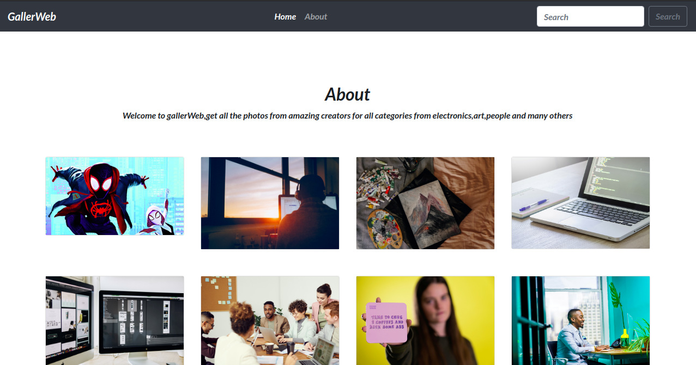
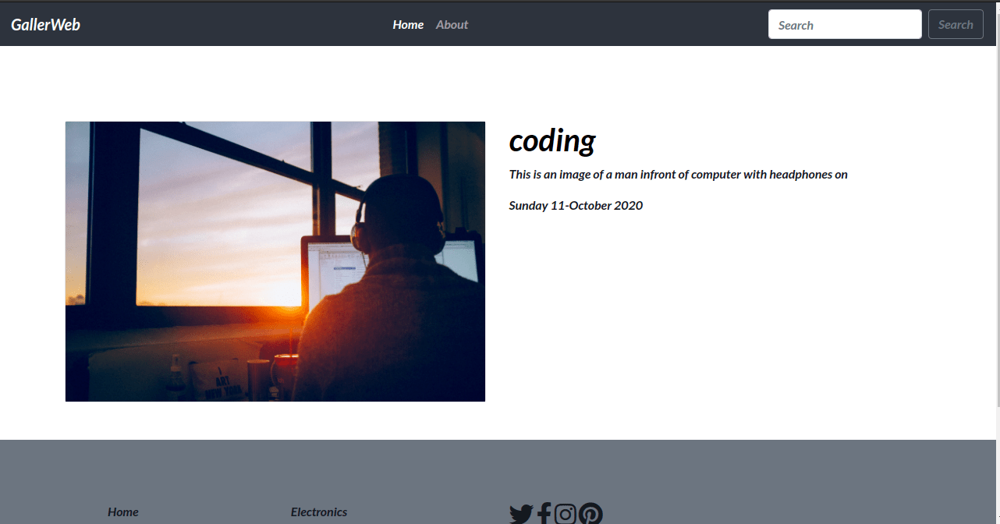

# Gallery App
This  project is a [gallery](https://gallery97.herokuapp.com)website where users can  search for  images  check their details and dowload them
 Heres the home page
 
 On clicking a single image
 


## Author
* Thomas Khaemba 

## Features
* The website has a searchbar where you can search for images based on their name
* The inages are clickable which reveal the  details of the webpage
* The website has a footer with fontawesome icons and afew details
* 

## Installations 
For this project to run one needs python  and pip installations

```
$ sudo apt-get install python3.8.
```
for pythons3.4 and later comes with pip  to check if pip is install run the following command
```
$ command -v pip
```
After installing the python you need to install virtual env which you can install by following  these [instructions](https://packaging.python.org/guides/installing-using-pip-and-virtual-environments/)

## Set Up
You can access this project by copying the  repository link or downloading the zip file
if downloaded go to the  zipped folder  and right click and it will give you a menu bar then select extract here or choose the folder to extract
 if copied the repository you can follow these steps:

 ```
 $ git clone <repo>
 ````
  after cloning go the to cloned project folder

  ```
  $cd <project-directory>
  ```
  You then create a virtual env for your project.
  ```
  $ python3 -m venv <nameofvirtualenv>
  ```
  you then activate the virtual env
  ```
  $ source <nameofvirtualenv>/bin/activate
  ```
  Then run the following command to install all the projects dependenacies
```
  $ pip install -r requirement.txt
```
Then get to the project on the IDE
```
$ cd <project-directory>
```
 You then create postgresql database on your machine then link it on your project
After linking run migrations  then create a super user account on your terminal for the admin page
```
$ python manage.py createsuperuser
```
Then add your credententials then load the project
```
$ python3 manage runserver
````
click on the link provided when you get to the site  on browsers searchbar   add  
```
/admin
```
at the end of the local host

then login and you can now add images ,update or delete the images

## Technologies Used
* Python
* Django
* Postgresql
* Bootstrap4
* CSS3
* HTML

## Collaboration
If you would like to collaborate you can run the above commands 

## Contact and Support
For any queries or collaboration  contact tommybwah@gmail.com

## License and corporation
licensed under [MIT](license)
